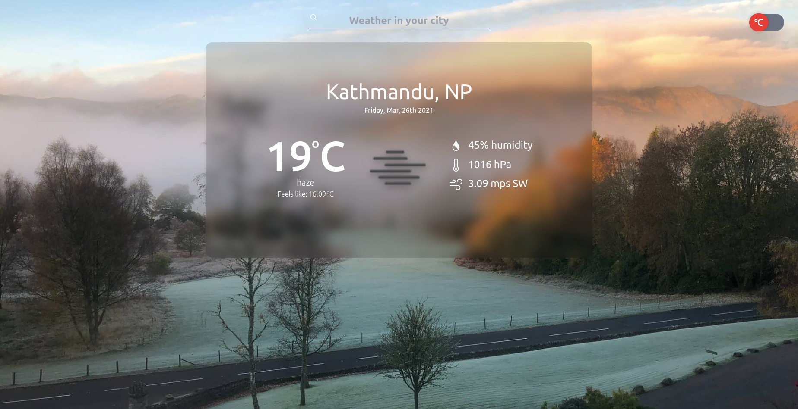

# Weather app

## Table of contents

- [About](#about)
- [Features](#features)
- [Live demo](#live-demo)
- [Built with](#built-with)
- [Getting started](#getting-started)
  * [Installation instructions](#installation-instructions)
- [Authors](#authors)
- [Contributing](#-contributing)
- [Show your support](#show-your-support)
- [Acknowledgements](#acknowledgments)
- [License](#-license)

---

## About

A weather app to display the weather information using [openweather API](https://openweathermap.org/api) data with JavaScript.

## Features

The features of this project are:

- Users can search for the city and get the weather information
- users can toggle the temperature between Celsius and Fahrenheit.
- Users toggle state, will be saved in local storage for future reference of temperature state.

## Live Demo

This project is hosted on netlify.

[Live demo link](https://find-the-weather.netlify.app/)
## Built With

- HTML
- CSS
- JavaScript

## Getting Started

### Installation instructions

Follow along the steps below to get a copy at your local machine.

- Navigate to the directory where you want this project to clone and then clone it `git clone https://github.com/dipbazz/weather-app.git`
- Navigate to the `weather-app` directory
- Install the npm package with `npm install`
- Start the server with `npm run start`
- The site should automatically open on your browser at http://localhost:8080/ if it didn't, then open your browser with that link.

## Authors

👤 **Dipesh Bajgain**

- GitHub: [@dipbazz](https://github.com/dipbazz)
- Twitter: [@dipbazz](https://twitter.com/dipbazz)
- LinkedIn: [Dipesh Bajgain](https://www.linkedin.com/in/dipbazz/)

## 🤝 Contributing

Contributions, issues, and feature requests are welcome!

## Show your support

Give a ⭐️ if you like this project!

## Acknowledgments

- Background images for weather is from [unsplash](https://unsplash.com/)
- Icons used from [iconify.design](https://iconify.design/)
- weather api is used from [openweather](https://openweathermap.org/api)
- this [article](https://www.campbellsci.com/blog/convert-wind-directions) was a really helpful to calculate the wind direction from deg to string value.
- thanks to [Rem Tsoy](https://dribbble.com/remtsoy) for the wonderful [weather app design](https://dribbble.com/shots/1663525-Weather-Widget-freebie-HTML-CSS)

## 📝 License

This project is [MIT](./LICENSE) licensed.
